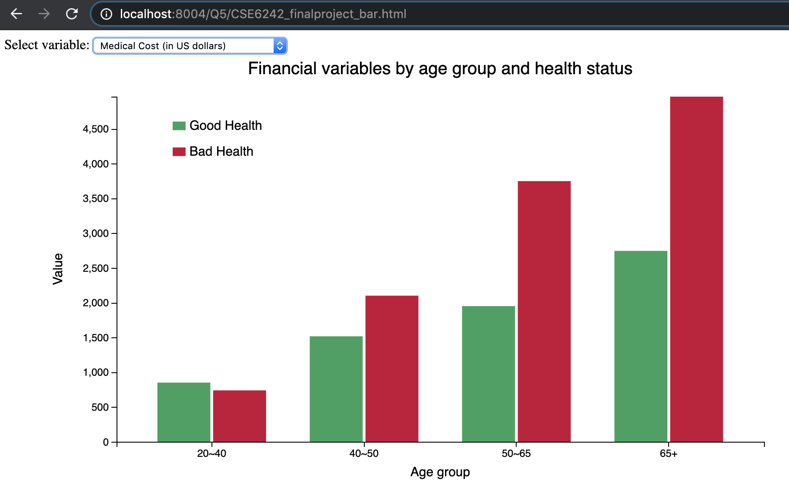

This section plots financial variables of household respondent for different groups of age and health status.

* medical expendicure

Format: 

* labor income

Format: 

* accumulative wealth 

Format: 

* stock investment 

The corresponding HTML file is in [CSE6242_finalproject_bar.html]()

